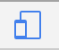
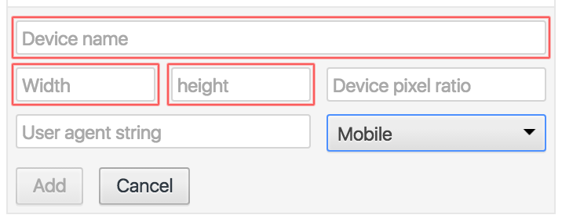

Web development tips for our large screens
---
While web delivery is an attractive option for some video wall content, inferring how the layout will be rendered on a large display is not straightforward for the layperson. Since you probably don’t have a desktop with enough pixels to simulate our video walls, it is especially important to test your prototypes at the Hunt Library with NCSU Libraries staff.

When programming for different size canvases it is important to represent pixels and pixel calculations as a percentage of the canvas and not fixed pixels. For example, a 50 pixel circle looks fine on a 1920 x 1080 display but when displayed on the walls it may look like a dust particle. Representing the circle at .026 x canvas width would give you a 50 pixel circle on the 1920 canvas and 156 pixel circle on a 6000 x 1200 canvas.

Chrome's Device Mode & Mobile Emulation can also be useful for designing web pages for the visualization spaces, so you can change the resolution dimensions to the size of the video wall for which you are designing. See the steps below or Google's documentation for this feature at https://developers.google.com/web/tools/chrome-devtools/iterate/device-mode/emulate-mobile-viewports

### Other tips
* Web pages are displayed on the video walls using the latest stable version of Chrome.
* Your web page or app will be refreshed each time our scheduler loads it.
* Build a dedicated template or CSS for displaying on “large-devices.” Your HTML will probably need to be structured differently, with the CSS sizing things differently for large displays.
* Use responsive HTML practices.
* Use relative sizes. Percentages and relative positioning are better than absolute and fixed positioning to have responsive design.
* Validate your HTML using the W3C Validator Service. Valid HTML will behave more predictably.
* Test test test.

### How to add a custom device for emulation to Chrome developer tools
In the Chrome browser you can emulate any of the video walls by creating a custom device in Chrome developer tools. These steps are a guide for adding a custom device to the list of emulated devices in Chrome developer tools. This was last evaluated in Chrome version 51.0.

1. In the Chrome browser press `Opt` + `Cmd` + `i` (`Ctrl` + `Shift` + `i` on Windows) to open Chrome developer tools.

2. In the pane or window that appears, click the 'Toggle Device Toolbar' on the left-hand side of the developer tools menu bar to ensure that it is highlighted in blue:

  

3. The device toolbar will now be visible in the browser window. Click on the dropdown on the far-left of the device toolbar in the browser window and then select `Edit...` from the menu.

  

4. The 'Emulated Devices' settings window will appear. In this window click the button `Add custom device...`

5. In the dialogue menu that appears input a name for your device, input the screen width and height, and select the type of device from the dropdown menu (if designing for the Hunt video walls select 'Desktop'). Click the `Add` button to add the device to the emulation list. **See the table of video wall names and dimensions at the bottom of this document for reference if adding a wall for emulation.**

  

6. The new device is now available in the devices dropdown menu in the browser window (the same dropdown menu from step 3). Select the device from the menu to emulate it in your browser.

### Hunt video wall pixel size

| Wall Name          | Width (px) | Height (px) |
|---                 |:---:       |:---:        |
| Art Wall           | 5760       | 2304        |
| Immersion Theater  | 6816       | 2240        |
| Commons Wall       | 2880       | 2400        |
| Visualization Wall | 3840       | 1518        |
